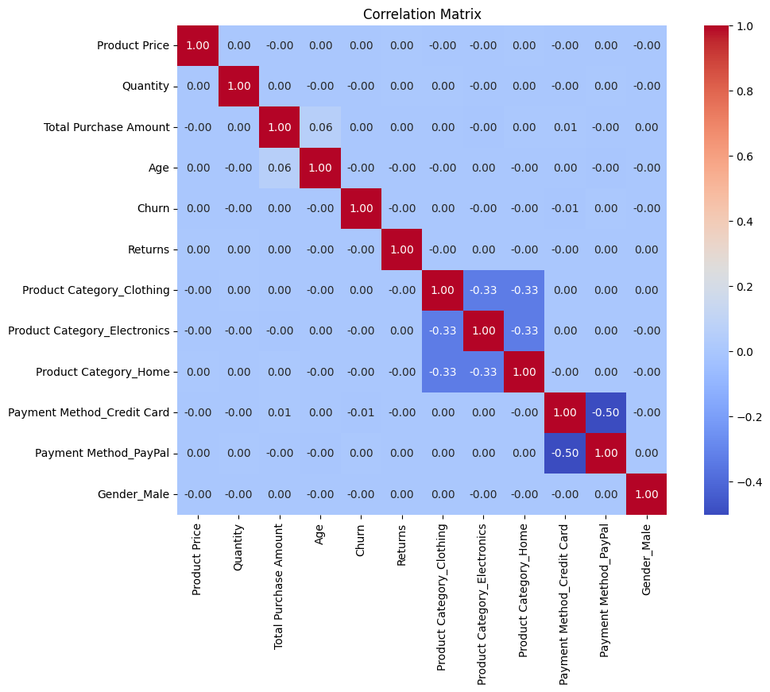
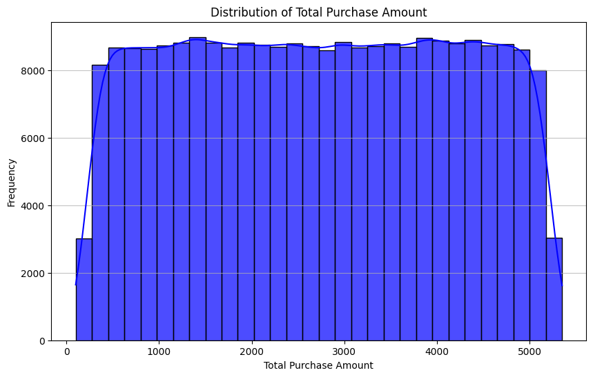
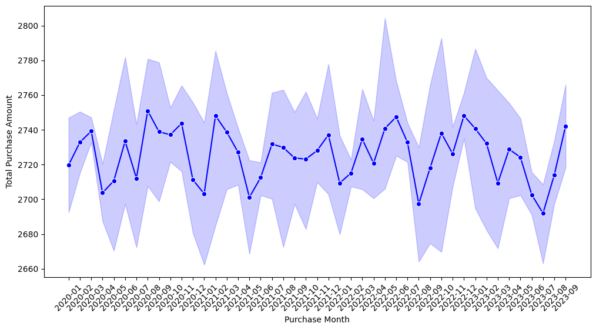
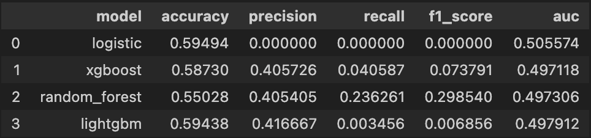
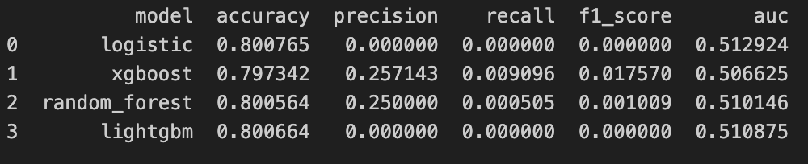
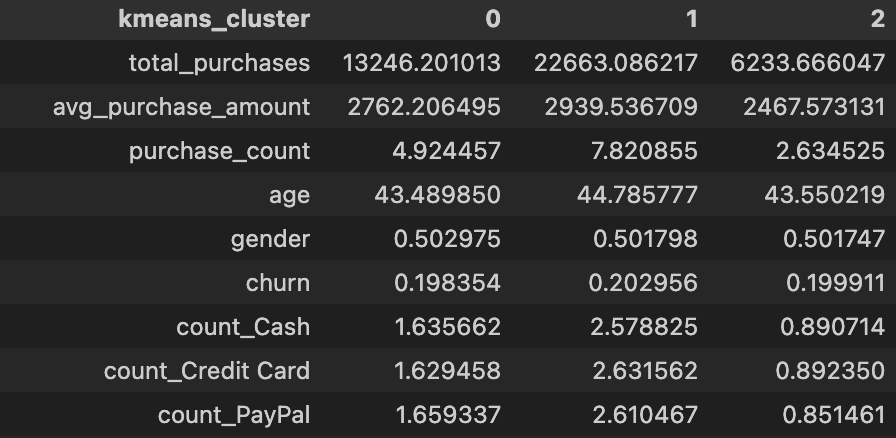
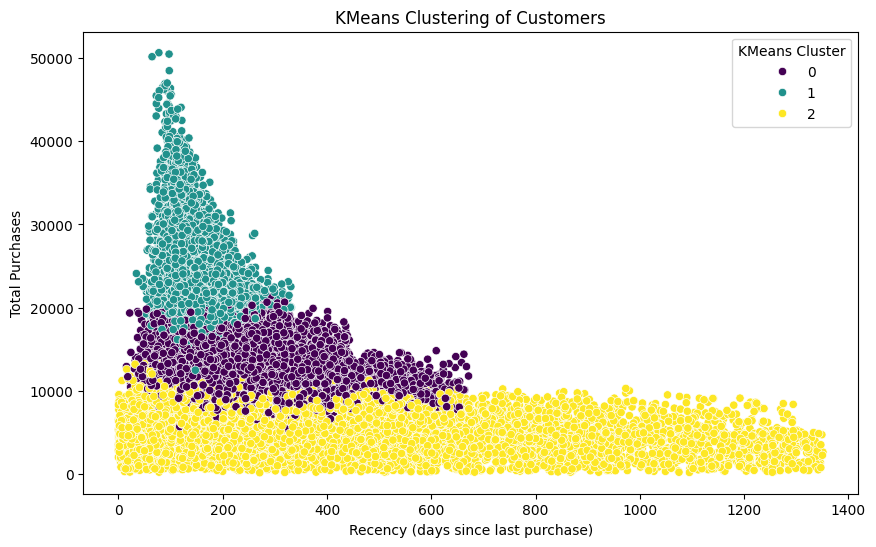

# Business Report: E-commerce Customer Analysis (Practice Project)

## 1. Data Source
The data used in this project is from open data sources and is intended solely for practice and demonstration purposes.

## 2. Project Structure
We divided the analysis into three main parts:

### Part 1: Exploratory Data Analysis (EDA)
- **Objective:** Understand the data structure, clean the data, and explore basic attributes such as transaction amounts and feature correlations.
- Data Preprocessing: 
    1. Fill na with zero for all rows of Returns: around 20% of rows are na. Here we assume that na values belong to "no return" which equals to zero.
    2. Remove duplicated columns: "Customer Age" and "Age" are identical, hence we remove "Age" from data. 
    3. Check whether a customer has only unique churn values -> yes
    4. Transfer data type to suitable one for each column
- [EDA] Decriptive Statistics:
    1. it is inferred that the data is artificially generated and does not represent real-world data.
    2. independent correlation matrix
    
    3. Total Purchase Amount is nearly uniformly distributed
    

### Part 2: Transaction Analysis

#### Question 1: Are there relationships between 'Payment Method' and 'Total Purchase Amount'?
- Plots and t-tests suggest that customers using credit cards tend to spend differently compared to those using cash or PayPal.
- However, considering credit card transaction fees, higher average purchase amounts may not translate to higher profitability.
- print("Average Total Purchase Amount by Payment Method:")

#### Question 2: Does the data exhibit seasonality?
- No significant seasonality was found after conducting an F-test.
- The Total purchase amount respective to the purchase month

- ANOVA F-statistic: 0.6167853606771777, P-value: 0.9669183587213135
No significant difference in total purchase amounts across months, indicating no seasonality.

#### Can returns be predicted based on other features?
- Models tried: Logistic Regression, XGBoost, LightGBM, Random Forest.
- **Result:** All models yielded an AuC around 0.5, indicating no better performance than random guessing.
    - The available features may not provide enough information to predict returns.
    - Returns may be influenced by factors not captured in the dataset, such as customer behavior, product quality, or external market conditions.
- The performance of each model:

### Part 3: Customer-Level Analysis

#### Can customer churn be predicted based on the features?
1. **Step 1:** Transform features into a customer-level DataFrame with unique customer IDs, including:
    - Frequency, total, and average purchase amount by payment method.
    - Count and amount of purchases by product category.
2. **Step 2:** Train and evaluate models to predict customer churn.
3. **Results:**
    - Even after transforming data to customer-level features, models could not predict churn well (AuC 0.5–0.51).
    - Possible reasons:
        - Features may not be sufficient to predict churn.
        - The definition of churn may not be clear or consistent.
        - The dataset may lack enough historical data to capture churn patterns.
    - 

#### Can transaction data be segmented with unsupervised learning methods to identify distinct customer groups?
- Although supervised models could not predict churn or returns well, unsupervised learning was explored for customer segmentation.
- **Methods tried:**
    - K-Means
    - Hierarchical Clustering
    - DBSCAN
- **Result:** No clear, meaningful, or actionable customer segments were identified. Clusters mainly differed in Recency, Frequency, and Monetary value, with demographic features not considered.
  - K-Means clustering as example:
  - The average value of each segmentation 
  - mainly differ on total purchases 

#### RFM Model Application
- Applied the traditional RFM (Recency, Frequency, Monetary) model to classify customers.
- This segmentation can inform marketing strategies, such as offering different discount levels to each segment.
- Effectiveness can be tested through A/B testing in real-world scenarios.

## Conclusion
While the dataset appears artificial with independent features and clear patterns, it serves as a good practice resource for basic data analysis and modeling. Real-world data is often more complex, but foundational analytical methods remain valuable for exploring and understanding new datasets.